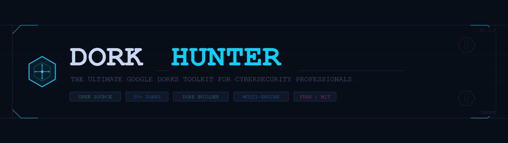

<div align="center">



# ⬡ DorkHunter

**The ultimate Google Dorks toolkit for cybersecurity professionals.**  
A free, open-source Chrome extension - no login, no tracking, no ads.

[](https://github.com/Aziuk/dorkhunter/releases)
[](LICENSE)
[](https://github.com/Aziuk/dorkhunter)
[](CONTRIBUTING.md)
[](https://github.com/Aziuk/dorkhunter/stargazers)

[Install](#-installation) · [Features](#-features) · [Screenshots](#-screenshots) · [Contribute](#-contributing) · [Roadmap](#-roadmap)

</div>

---

## 🔍 What is DorkHunter?

**DorkHunter** is a Chrome browser extension built for cybersecurity professionals, bug bounty hunters, penetration testers, and OSINT researchers. It gives you instant access to **50+ preloaded Google Dorks**, a **visual Dork Builder**, an **Operator Cheatsheet**, and full management of your own custom dork library - all in one click from your browser toolbar.

> ⚠️ **Ethical Use Only.** This tool is intended for authorized security testing, bug bounty programs, and legitimate OSINT research. Do not use it to access systems you do not own or have explicit permission to test. See [DISCLAIMER](#️-disclaimer).

---

## ✨ Features

| Feature | Description |
|---|---|
| 📚 **50+ Preloaded Dorks** | Organized across 9 categories out of the box |
| ⚒ **Dork Builder** | Visual form to build complex queries without memorizing syntax |
| 📖 **Operator Cheatsheet** | Inline reference for all Google Dork operators with examples |
| 📌 **Pin Dorks** | Pin important dorks to always appear at the top |
| 🔎 **Multi-Engine Search** | Google, Bing, and DuckDuckGo support |
| 🏷 **Categories & Tags** | Organize dorks your way - fully customizable |
| ⏱ **Target Memory** | Remembers your last 5 targets so you don't retype them |
| ✏️ **Full CRUD** | Add, edit, delete your own dorks anytime |
| ⬇ **Export / Import** | Back up or share your dork library as JSON |
| ⌨️ **Keyboard Shortcuts** | `A` = Add, `B` = Builder, `/` = Search, `Esc` = Close |
| 🔒 **100% Local** | All data stays in your browser - zero external servers |

---

## 📦 Installation

### Method 1 - Manual Install (Recommended for now)

> Chrome Web Store submission is in progress. Until then, install manually in under 60 seconds.

1. **Download** the latest release ZIP from the [Releases page](https://github.com/Aziuk/dorkhunter/releases/latest)

2. **Unzip** the file - you'll get a folder called `dork-extension`

3. Open **Chrome** and go to:
   ```
   chrome://extensions
   ```

4. Enable **Developer Mode** using the toggle in the top-right corner

   

5. Click **"Load unpacked"** and select the `dork-extension` folder

6. The ⬡ DorkHunter icon will appear in your Chrome toolbar  
   *(If not visible, click the puzzle piece 🧩 icon and pin it)*

### Method 2 - Clone & Load

```bash
# Clone the repository
git clone https://github.com/Aziuk/dorkhunter.git

# Navigate into the extension folder
cd dorkhunter/dork-extension

# Then follow steps 3–6 above in Chrome
```

---

## 🚀 Quick Start

Once installed, click the ⬡ icon in your toolbar:

1. **Browse dorks** - Scroll or use the search bar to find what you need
2. **Filter by category** - Use the tabs at the top (Reconnaissance, File Search, etc.)
3. **Filter by tag** - Click any `#tag` chip to narrow results
4. **Run a dork** - Click the **▶** button on any card
5. **Set a target** - If the dork has `{target}`, you'll be prompted to enter a domain
6. **Build a custom dork** - Click ⚒ in the header to open the Dork Builder

---

## 🗂 Dork Categories

| Category | What's Inside |
|---|---|
| 🔭 **Reconnaissance** | Site enumeration, subdomains, cached pages, related sites |
| 📄 **File Search** | PDF, SQL, Excel, logs, backups, archives, configs |
| 🔐 **Login Pages** | Admin panels, cPanel, phpMyAdmin, WordPress, VPN, webmail |
| 📁 **Exposed Directories** | Open index listings, uploads, backups, default server pages |
| 🔑 **Sensitive Info** | Emails, passwords, .env files, API keys, AWS credentials, SSH keys |
| 🐛 **Vulnerabilities** | SQL errors, PHP errors, exposed .git, open redirects, debug mode |
| ☁️ **Cloud & APIs** | S3 buckets, Azure Blob, GCP, GitHub leaks, Pastebin |
| 🧩 **CMS & Frameworks** | WordPress, Drupal, Laravel, Django, Jenkins |
| 📝 **Miscellaneous** | Everything else - user-defined |

---

## ⚒ Dork Builder

The Dork Builder is a guided form that assembles complex queries for you:

```
site:       [example.com      ]  → Restrict to a domain
filetype:   [pdf, sql, env    ]  → Filter by file type
inurl:      [admin, login     ]  → Keyword in URL
intitle:    ["index of"       ]  → Keyword in page title
intext:     [password         ]  → Keyword in page body
-inurl:     [htm, html        ]  → Exclude from URL
"phrase"    [exact match      ]  → Exact phrase
```

**Live preview** updates as you type. Hit **▶ Search** to run immediately or **Save as Dork** to add it to your library.

---

## 📖 Operator Reference

| Operator | What it does | Example |
|---|---|---|
| `site:` | Restrict to a domain | `site:example.com` |
| `filetype:` | Filter by extension | `filetype:pdf` |
| `inurl:` | Keyword in URL | `inurl:admin` |
| `intitle:` | Keyword in page title | `intitle:"index of"` |
| `intext:` | Keyword in body text | `intext:"password"` |
| `related:` | Similar websites | `related:example.com` |
| `cache:` | Cached snapshot | `cache:example.com` |
| `-keyword` | Exclude a term | `-inurl:htm` |
| `"phrase"` | Exact phrase match | `"index of /"` |
| `OR` | Either term (uppercase) | `filetype:doc OR docx` |
| `*` | Wildcard | `site:*.example.com` |

---

## 🌐 Search Engine Support

| Operator | Google | Bing | DuckDuckGo |
|---|:---:|:---:|:---:|
| `site:` | ✅ | ✅ | ✅ |
| `filetype:` | ✅ | ✅ | ⚠️ Partial |
| `inurl:` | ✅ | ⚠️ Partial | ❌ |
| `intitle:` | ✅ | ⚠️ Partial | ❌ |
| `intext:` | ✅ | ❌ | ❌ |
| `cache:` | ✅ | ❌ | ❌ |
| `related:` | ✅ | ❌ | ❌ |

> **Recommendation:** Use Google for best results. Bing and DuckDuckGo are useful when Google blocks repeated queries.

---

## ⌨️ Keyboard Shortcuts

| Key | Action |
|---|---|
| `A` | Open Add Dork panel |
| `B` | Open Dork Builder |
| `/` | Focus search bar |
| `Esc` | Close any open panel |

> Shortcuts are disabled when typing in input fields.

---

## 📤 Export & Import

**Export:** Click ⬇ in the header → saves `dorkhunter-export.json`  
**Import:** Click ⬆ in the header → select a JSON file → dorks are merged (no duplicates)

JSON format:
```json
{
  "version": "2.0",
  "cats": ["Reconnaissance", "File Search"],
  "dorks": [
    {
      "id": "d1",
      "name": "Open Directories",
      "query": "intitle:\"index of\" site:{target}",
      "desc": "Apache/Nginx open directory listings",
      "category": "Exposed Directories",
      "tags": ["directory", "listing"],
      "engines": ["google", "bing"],
      "pinned": false
    }
  ]
}
```

---

## 🗺 Roadmap

- [ ] Chrome Web Store listing
- [ ] Firefox / Edge / Brave support

Have a feature idea? [Open an issue](https://github.com/Aziuk/dorkhunter/issues/new?template=feature_request.md) or [submit a PR](CONTRIBUTING.md).

---

## 🤝 Contributing

Contributions are what make open source great. All contributions welcome - new dorks, bug fixes, features, documentation.

See **[CONTRIBUTING.md](CONTRIBUTING.md)** for full guidelines.

**Quick contribution - add a dork:**  
Edit `dork-extension/popup.js` → find `DEFAULT_DORKS` array → add your dork following the existing format → open a Pull Request.

---

## 📁 Repository Structure

```
dorkhunter/
├── dork-extension/          # The Chrome extension (load this folder)
│   ├── manifest.json        # Extension manifest (MV3)
│   ├── popup.html           # Extension popup UI
│   ├── popup.css            # Styles (dark cybersecurity theme)
│   ├── popup.js             # All logic - dorks, builder, storage
│   └── icons/               # Extension icons (16, 48, 128px)
│       ├── icon16.png
│       ├── icon48.png
│       └── icon128.png
├── assets/                  # Screenshots and images for README
├── .github/
│   ├── ISSUE_TEMPLATE/
│   │   ├── bug_report.md
│   │   └── feature_request.md
│   └── PULL_REQUEST_TEMPLATE.md
├── README.md                # This file
├── CONTRIBUTING.md          # Contribution guidelines
├── CHANGELOG.md             # Version history
└── LICENSE                  # MIT License
```

---

## ⚖️ Disclaimer

DorkHunter is provided for **educational and authorized security testing purposes only**.

- Only use this tool on systems you **own** or have **explicit written permission** to test
- The authors are **not responsible** for any misuse or damage caused by this tool
- Using Google Dorks against systems without authorization may violate laws including the **Computer Fraud and Abuse Act (CFAA)** and equivalent legislation in your country
- Respect Google's Terms of Service - excessive automated queries may result in IP blocks

**Use responsibly. Hack ethically.**

---

## 📄 License

MIT License - see [LICENSE](LICENSE) for full text.  
Free to use, modify, and distribute. Attribution appreciated.

---

<div align="center">

Made with 🖤 for the cybersecurity community

⭐ **Star this repo if DorkHunter helps your work** ⭐

[Report a Bug](https://github.com/Aziuk/dorkhunter/issues/new?template=bug_report.md) · [Request a Feature](https://github.com/Aziuk/dorkhunter/issues/new?template=feature_request.md) · [Submit a Dork](CONTRIBUTING.md)

</div>
